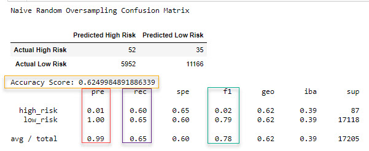
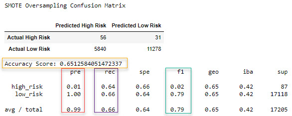
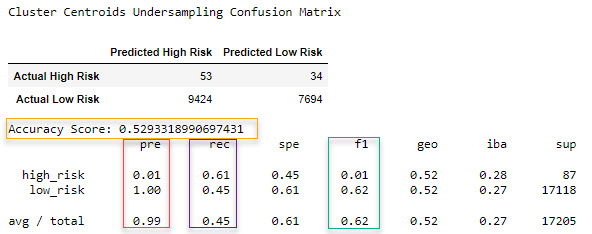
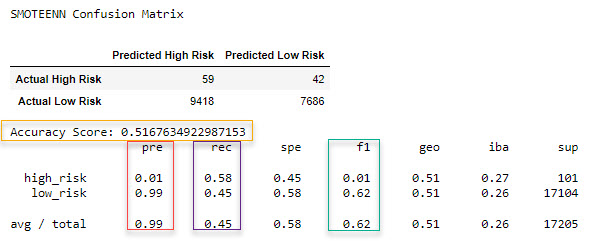
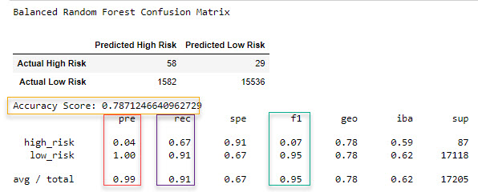
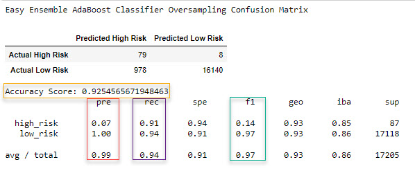

## Overview Of Analysis

This project is designed to apply machine learning to solve credit card risk. Different models will be used to analyze the data. We will use imbalanced-learn and scikit-learn libraries to build and evaluate models using resampling.

Using the credit card credit dataset from LendingClub, a peer-to-peer lending services company, the data will be oversampled using the RandomOverSampler and SMOTE algorithms, and undersampled using the ClusterCentroids algorithm. A combination of over- and undersampling will be used with the SMOTEENN algorithm. Two new machine learning models that reduce bias, BalancedRandomForestClassifier and EasyEnsembleClassifier, are used to predict credit risk. 

## Results

The balanced accuracy scores, precision and recall scores below display the results of the various models for comparison.

### Accuracy Scores

Accuracy is the percentage of predictions that are correct. This method compares the actual outcome (y) values from the test set against the model's predicted values. 

- RandomOverSampler: 0.62
- SMOTE: 0.65
- ClusterCentroids: 0.53
- SMOTEENN: 0.52
- BalancedRandomForestClassifier: 0.79
- EasyEnsembleClassifier: 0.93

### Precision Scores

Precision is a measure of how reliable a positive classification is. 

- RandomOverSampler: 0.99
- SMOTE: 0.99
- ClusterCentroids: 0.99
- SMOTEENN: 0.99
- BalancedRandomForestClassifier: 0.99
- EasyEnsembleClassifier: 0.99

### Recall Scores

A test with high sensitivity (recall) means few false negatives, though there may be a high number of false positives.  Recall is the ability of the classifier to find all the positive samples. 

- RandomOverSampler: 0.65
- SMOTE: 0.66
- ClusterCentroids: 0.45
- SMOTEENN: 0.45
- BalancedRandomForestClassifier: 0.91
- EasyEnsembleClassifier: 0.94

### F1 Scores

The F1 score is a combination statistic of precision and recall. A pronounced imbalance between sensitivity and precision will yield a low F1 score.

- RandomOverSampler: 0.78
- SMOTE: 0.79
- ClusterCentroids: 0.62
- SMOTEENN: 0.62
- BalancedRandomForestClassifier: 0.95
- EasyEnsembleClassifier: 0.97

- **RandomOverSampler**

	

- **SMOTE**

	

- **ClusterCentroids**

	

- **SMOTEENN**

	

- **BalancedRandomForestClassifier**

	

- **EasyEnsembleClassifier**

	

## Summary

Of the six models, the Easy Ensemble AdaBoost Classifier has the best accuracy score. Its accuracy score is 0.93, meaning that 93% of the predictions in the model are correct. The next closest accuracy measure is for the Balanced Random Forest Classifier, with an accuracy score of 0.79.

The recall (sensitivity) rate is best with the Easy Ensemble model (0.94). This means that there are few false negatives, although there model may predict false positives because the score is so high.

The precision scores for all of the models is 0.99, so each of the models does a very good job in accurately predicting positive values. 

The F1 score for the Easy Ensemble model again is the best among all the models (0.97). The Easy Ensemble model provides the best prediction of all six models for credit risk among applicants.